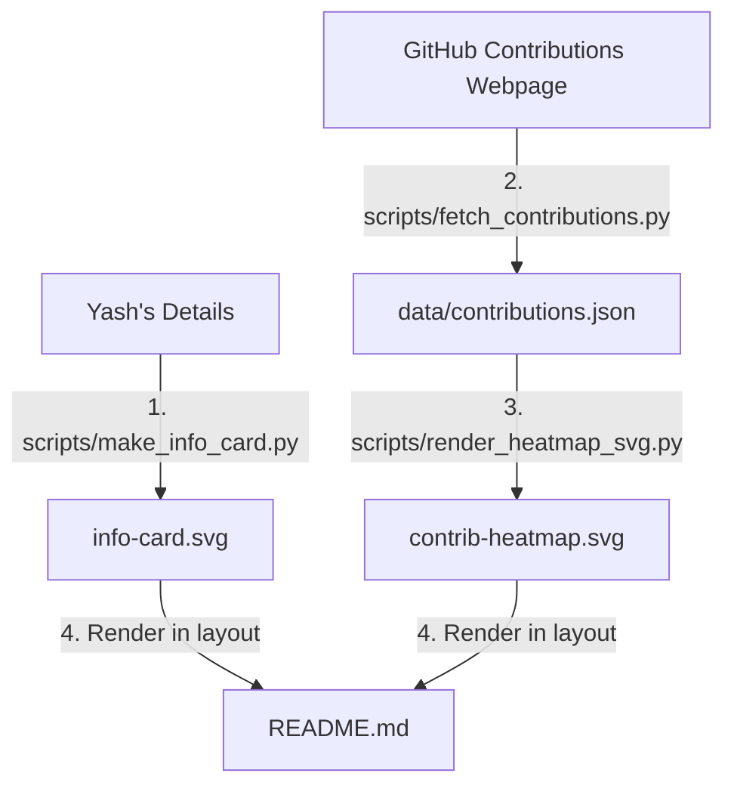

# Yash Vekariya's Animated GitHub Profile README

This workspace contains all Python scripts, configuration files, and SVG assets required to recreate Avi Vashishta's legendary animated terminal-style profile README.

## 🛠️ Architecture & Script Pipeline

The architecture consists of a sequence of local Python jobs that scrape data and compile animated SVGs suitable for rendering inside GitHub `` CAMO tags (which strip scripts but fully support CSS/SMIL animations).



### 1. `scripts/make_info_card.py`
Generates a gorgeous Matte Black `#0d1117` terminal card mock:
*   Styled like a macOS neofetch system panel with close/minimize/zoom colored buttons.
*   Draws a glowing neon blue code brace `</>` logo alongside custom Yash details mapped to system criteria (`OS`, `Host`, `Kernel`, `Shell`, `Uptime`, `Memory`).
*   **Animation**: CSS/SMIL keyframe translations that smoothly slide down and fade in each line sequentially (`0.12s` stagger).

### 4. `scripts/fetch_contributions.py`
BS4 Web Scraper:
*   Fetches the public GitHub page `https://github.com/users/yashvekariya01/contributions`.
*   Extracts total contribution count from the page headers using regex.
*   Scrapes levels for each `ContributionCalendar-day` and outputs structured JSON to `data/contributions.json`.

### 5. `scripts/render_heatmap_svg.py`
Reads scraped contribution history and compiles SVG:
*   Lays out 53 weeks x 7 days grid with official GitHub green shade levels (`#161b22` $\rightarrow$ `#39d353`).
*   Draws Month axis labels dynamic to data dates and Day-of-week guidelines.
*   **Animation**: Implements a diagonal stagger delay (`delay = (col + row) * 0.012s`) using `<animateTransform>` translation. When loaded, boxes slide up and fade into view diagonally across the board.

---

## 🖥️ Local Execution

To regenerate the profile assets locally, ensure the `.venv` is activated:

```powershell
# Install dependencies
.venv\Scripts\pip install -r scripts/requirements.txt

# Run the complete pipeline
.venv\Scripts\python scripts/fetch_contributions.py
.venv\Scripts\python scripts/render_heatmap_svg.py
.venv\Scripts\python scripts/make_info_card.py
```

## 🔄 Automating with GitHub Actions

To make sure your contribution heatmap updates automatically on GitHub, you can add a simple workflow. Create a file `.github/workflows/update-readme.yml`:

```yaml
name: Update Profile SVGs

on:
  schedule:
    - cron: '0 0 * * *' # Runs every day at midnight UTC
  workflow_dispatch: # Allows manual trigger

jobs:
  run-pipeline:
    runs-on: ubuntu-latest
    steps:
      - name: Checkout repository
        uses: actions/checkout@v4

      - name: Set up Python
        uses: actions/setup-python@v5
        with:
          python-version: '3.11'
          cache: 'pip'

      - name: Install dependencies
        run: |
          python -m pip install --upgrade pip
          pip install -r scripts/requirements.txt

      - name: Run generation scripts
        run: |
          python scripts/fetch_contributions.py
          python scripts/render_heatmap_svg.py
          python scripts/make_info_card.py

      - name: Commit and Push changes
        run: |
          git config --global user.name "github-actions[bot]"
          git config --global user.email "41898282+github-actions[bot]@users.noreply.github.com"
          git add contrib-heatmap.svg info-card.svg data/contributions.json
          git diff --quiet & git diff --cached --quiet || git commit -m "auto-update: refresh contributions profile cards"
          git push
```
